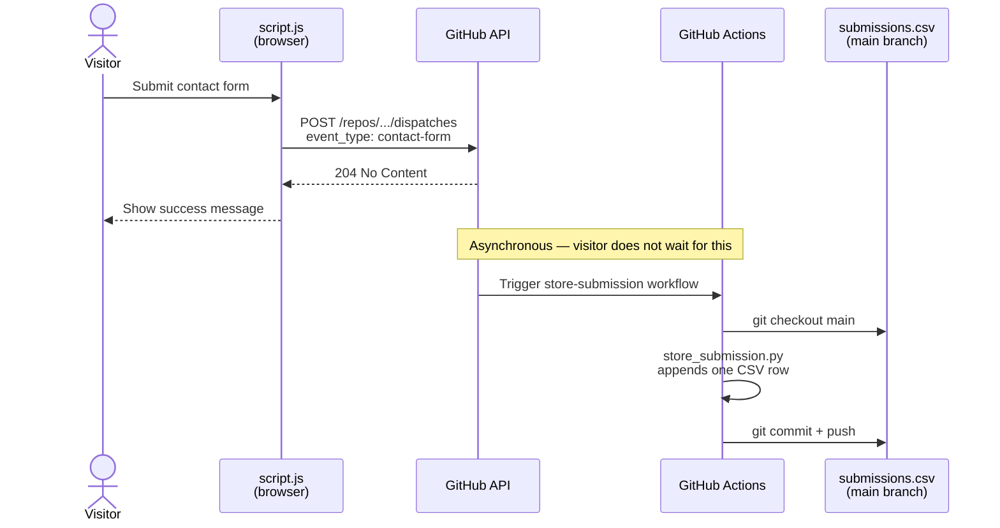

# Student Road to Germany

Myanmar → Deutschland consultation service — part of the [AlexSnow School Business](../) portfolio.

## Running locally

```bash
# Static site (from repo root)
python3 -m http.server 3001

# Contact form API — stores submissions in SQLite (dev only)
python3 studentroadtogermany/api.py
```

Open `http://localhost:3001/studentroadtogermany/` in your browser.

## Contact form — how submissions are stored

In **production**, form submissions are stored via GitHub Actions. When a visitor submits the contact form the browser POSTs directly to the GitHub repository dispatch API. A workflow runs, appends one row to `submissions.csv`, and commits the file back to the repository.



> The visitor sees the success message as soon as GitHub acknowledges the dispatch (204). The CSV is written asynchronously — typically within 30–60 seconds.

In **local development**, `api.py` handles the same endpoint and writes to `submissions.db` (SQLite, gitignored).

## GitHub Actions one-time setup

### 1. Create a fine-grained Personal Access Token

Go to: `github.com/settings/personal-access-tokens/new`

| Field | Value |
|---|---|
| Resource owner | `alexsnowschool-business` |
| Repository access | Only `alexsnowschool-business.github.io` |
| Permissions → Contents | Read and write |

### 2. Store it as a repo secret

`Repository → Settings → Secrets and variables → Actions → New repository secret`

| Name | Value |
|---|---|
| `GITHUB_DISPATCH_TOKEN` | the PAT from step 1 |

The token is **never committed to the repository**. The deployment workflow (`static.yml`) injects it into `script.js` at build time before uploading to GitHub Pages.

### 3. Push to GitHub

On the next push to `main`, `static.yml` will:
1. Replace the `YOUR_FINE_GRAINED_PAT` placeholder in `script.js` with the real token from the secret
2. Deploy the patched file to GitHub Pages

The `store-submission` workflow only runs on `repository_dispatch` events with type `contact-form` — regular git pushes skip it entirely. It uses the built-in `GITHUB_TOKEN` (with `contents: write`) to push the CSV back.

## Reading submissions

`submissions.csv` in this directory is appended to by every form submission and committed to the repo. Open it directly or query it:

```bash
python3 -c "
import csv
rows = list(csv.DictReader(open('studentroadtogermany/submissions.csv')))
print(f'{len(rows)} submission(s)')
for r in rows:
    print(f\"  {r['submitted_at']}  {r['name']} <{r['email']}>  [{r['package']}]\")
"
```

## Security note

The fine-grained PAT is **not stored in the repository** — it lives only in GitHub Secrets and is injected at deploy time. It is still visible in the deployed `script.js` on GitHub Pages, scoped to this one repository with `Contents: Read and write` only. The worst case is someone triggering extra workflow runs (which consume Actions minutes). For higher-traffic use, wrap the dispatch call in a Cloudflare Worker to keep the token out of the browser entirely.

## File structure

```
studentroadtogermany/
├── index.html              # Main page
├── styles.css
├── script.js               # Form → GitHub repository_dispatch
├── api.py                  # Local dev API server (SQLite)
├── store_submission.py     # Workflow script — appends to submissions.csv
├── submissions.csv         # Stored submissions (git-tracked)
└── README.md
```
