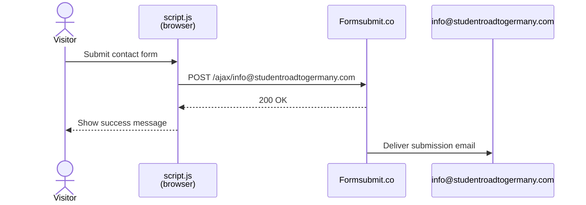

# Student Road to Germany

Myanmar → Deutschland consultation service — part of the [AlexSnow School Business](../) portfolio.

## Running locally

```bash
# Static site (from repo root)
python3 -m http.server 3001

# Contact form API — stores submissions in SQLite (dev only)
python3 studentroadtogermany/api.py
```

Open `http://localhost:3001/studentroadtogermany/` in your browser.

## Contact form — how submissions are stored

Form submissions are handled by [Formsubmit.co](https://formsubmit.co) — no tokens, no backend, no configuration required. Every submission is emailed to `info@studentroadtogermany.com` instantly.



In **local development**, `api.py` handles form submissions and writes to `submissions.db` (SQLite, gitignored).

## Formsubmit.co one-time activation

The first submission to a new email address triggers an activation email from Formsubmit.co. Click the confirmation link in that email — all subsequent submissions will be delivered without any further setup.

That is the only step required. No account, no API keys, no secrets.

## Security note

No tokens or secrets are stored in the codebase or exposed in the browser. Formsubmit.co acts as a serverless proxy — the browser POSTs to their endpoint and they forward the data by email.

## File structure

```
studentroadtogermany/
├── index.html        # Main page
├── styles.css
├── script.js         # Form → Formsubmit.co AJAX
├── api.py            # Local dev API server (SQLite)
├── submissions.csv   # Seed file (headers only — git-tracked)
└── README.md
```
